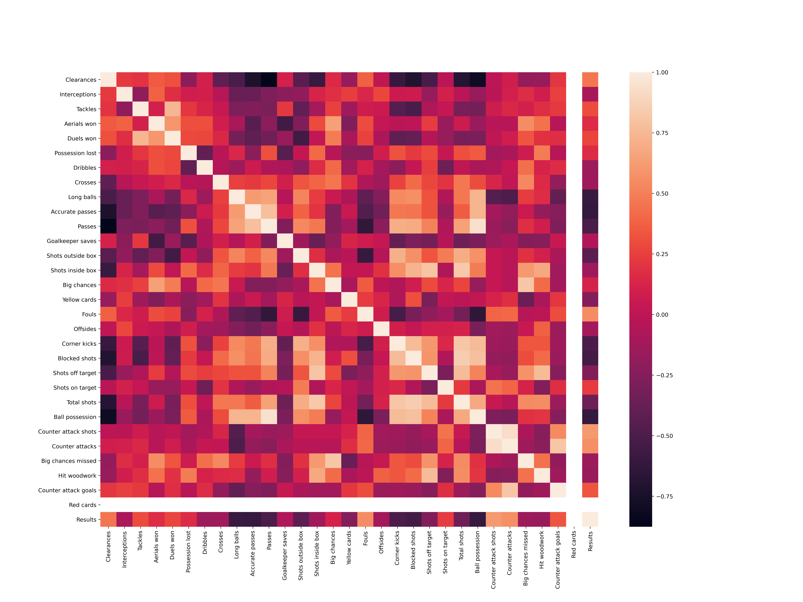

# Santos FC in the Brazil 2021 Championship analysis

## Introduction
As a supporter for the greatest team in Brazil I was looking for awsers for the bad season Santos is having (so far as 10/09/2021).
With this ideia in mind - and a little inspiration from the youtube channel : https://www.youtube.com/c/EuVimdeSantos ) - I made this brief analysis.
The lack of good data sources lead me to using the Sofascore API (https://rapidapi.com/apidojo/api/sofascore). I used that API to get all the data for the most recent games for the present season (2021) for the Série A championship.

## Data
After the data gathering, manipulation and cleaning the data is present as follows:

For the results I transformed each entrie as this: win = 1, draw = 0 and loss = -1.

The main statistics for this data :

https://github.com/leandrominer85/Santos/blob/f44858abd18667e8d8e6b897c3a46483ea555910/describe.csv

## Analysis

The main question, so far, is if the (former) manager and his play style lead to the bad results. For this I choose to see if there is a correlation between the results and the game statistics. This showed that the manager preferred play style (focused on passes and ball possession with crosses) is probably one of the main problems:

As we can see, the Passes, Blocked shots, Long balls, Accurate passes and Ball possession are all negatively correlated to the results. This points out to a team that plays in his own field - changing a lot of passes in the defence, having to block the attacking team and having to resort to long balls to try to attack.

This pattern is reinforced as we can see that Counter attack shots, Counter attacks, Fouls, Clearances and Counter attack goals are the top positively correlated statistics with positive results. This means that when the team wins the defensive play style works if the counter attack is succeeded.

We can see this trend in the heatmap:

For a better visualization of each statistic trend and the relation between it and the results i made a interactive graph (have fun):

[graph](https://htmlpreview.github.io/?https://github.com/leandrominer85/Santos/blob/f44858abd18667e8d8e6b897c3a46483ea555910/ResultsXStats.html)

